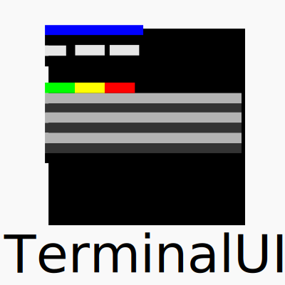

# Terminal UI

A C++ Library to Quickly create menu systems for Terminals

## Overview

This library provides a set of utilities for terminal UI formatting and user interaction. It includes functions for formatted output display, user input prompts, and menu systems.

## Formatted Outputs

The `formattedOutputs` namespace contains functions for formatted output display in the terminal. These functions include:

* `generateTitleBar`: Generate a title bar with a given text and color.
* `printHeaders`: Print headers for a menu with a given selection and colors.
* `highlightText`: Highlight a string in the output with a given color.
* `addMarker`: Add a marker in the output with a given color.
* `resetMarker`: Reset the marker in the output.
* `optionsMenu`: Print a menu with options.
* `fancyOptionsMenu`: Print a menu with options and custom colors.
* `binaryColorThresholdFormatedValue`: Print a value with a binary color threshold.
* `binaryColorAlternateFormatedValue`: Print a value with an alternating color.

## Formatted Prompts

The `formattedPrompts` namespace contains functions for formatted user input prompts in the terminal. These functions include:

* `customPrompt`: Prompt the user for input with a given symbol and color.
* `customPromptFormDualInputs`: Prompt the user for two inputs with messages and colors.

## io

The `io` namespace contains functions to print file contents on ther terminal. These function(s) include:

* `printFile`: Prints a given file line by line

## Terminal Formatting

The `terminalFormatting` namespace contains constants and functions for terminal output formatting. These include:

* ANSI escape codes for text colors and background colors.
* A function to clear the terminal screen.

You can use these functions and constants to create customized terminal UIs for your applications.